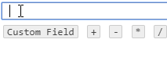

# FormulaJS

[](LICENSE)
[](https://github.com/Zenoo/FormulaJS/commits/master)

[](https://www.npmjs.com/package/@zenoo/formula-js)

 
Generate formulas on the fly

[](https://jsfiddle.net/Zenoo0/msgnwf2a/)

### Doc

* **Installation**

Simply import `formula.min.js` & `formula.min.css` into your HTML by downloading it or using a CDN.
```
<link rel="stylesheet" href="https://gitcdn.link/repo/Zenoo/FormulaJS/master/formula.min.css">
<script src="https://gitcdn.link/repo/Zenoo/FormulaJS/master/formula.min.js"></script>	
```

* **Demo**

A demo is available on this [JSFiddle](https://jsfiddle.net/Zenoo0/msgnwf2a/)

* **Usage**

Initialize your Formula by specifying a `wrapper` and some additional options:

```js
const formula = new Formula('#wrapper');
// OR
const formula = new Formula(wrapperElement);
// OR
const formula = new Formula(wrapperElement, options);
```

You can change the cursor position by clicking on an existing tag or pressing the left/right arrow keys.

* **Options**

The available options and their default values are:

```js
{
  separators: [' ', 'Enter'], // Characters that will process the inputted String into a new tag
  closers: '+-*/()%^',        // A chain of characters that will always trigger a new separate tag
  lang: {                     // Dictionary holder (The attribute 'field' is the only one needed right now)
    field: 'Custom Field'
  },
  customFields: undefined,    // Custom Fields to display, see below
  onFieldExpand: function(field){ ... } // Callback REQUIRED if you use the 'children: true' Field property. Expects a Field-like object to be returned
}
```

* **Custom Fields**

If you want to allow the user to pick from some predefined properties, you can use the `customFields` attribute:

```js
// Basic usage
const customFields = {
  firstField: {
    name: 'Pretty name'
  },
  whatever: {
    name: 'Prettier name'
  }
};

// Tree-like usage (you can deep-nest)
const customFields = {
  firstField: {
    name: 'Pretty name',
    children: {
      nestedField: {
        name: 'Hey ya'
      }
    }
  },
  whatever: {
    name: 'Prettier name'
  }
};

// Dynamic tree-like usage
const customFields = {
  firstField: {
    name: 'Pretty name',
    children: true // When using a Boolean as the children value, you have to use the 'onFieldExpand' callback, see below
  },
  whatever: {
    name: 'Prettier name'
  }
};
```

* **Dynamic fields**

Using `children: true` as a Field property forces you to specify the  `onFieldExpand` callback. It will be called every time a new subtree is opened by the user.  
The first parameter of this callback returns the field Node the user opened:
```HTML
<li class="formula-js-field" data-field="test" data-name="Hey">Hey<span class="children"></span></li>
```
The `data-field` and `data-name` attribute will allow you to build the subtree accordingly.

The `onFieldExpand` callback expects a Field-like object to be returned, which will be used to build the subtree.
```js
// Example
onFieldExpand: field => {
  const
	path = field.getAttribute('data-field'),
	children = grabChildren(path);

  return children.map(child => ({
    name: prettyName(child),
    children: hasChildren(child)
  }));
}
```

* **Methods**

The full documentation is available on [https://zenoo.github.io/FormulaJS/](https://zenoo.github.io/FormulaJS/).

  * **`.get()`**
  * **`.set(formulaString)`**
  * **`.add(formulaString)`**
  * **`.clear()`**
  * **`.destroy()`**

## Authors

* **Zenoo** - *Initial work* - [Zenoo.fr](http://zenoo.fr)
